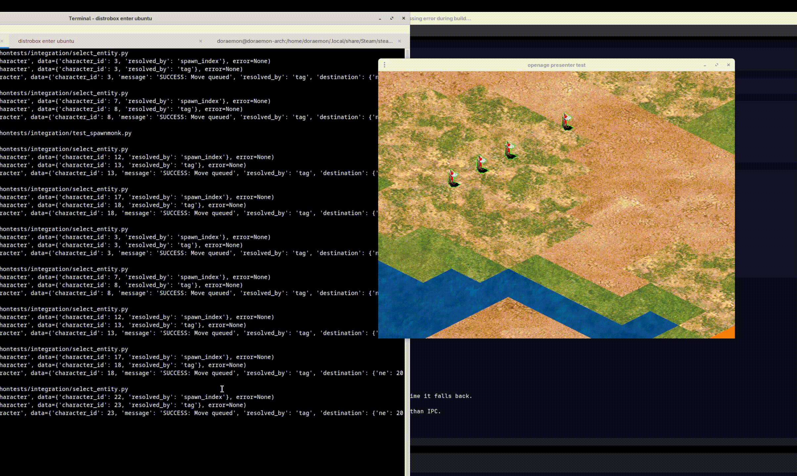

# openenv-0ad-bridge

Programmatic control of a running 0 A.D. match via the built-in RL interface HTTP server, with an OpenEnv-format proxy on top.

This can be used as an LLM arena: run multiple agents (e.g. `gpt-4o` vs `gpt-5`) that read a shared omniscient snapshot and issue low-level commands against the same running match.


## Origin Story

I first prototyped this concept on an open-source Age of Empires-style engine:

- Repo: https://github.com/SFTtech/openage

But that engine was still in development for ~10 years and I couldn’t proceed.
I later remembered that 0A.D. was also a development since long time and it turned out to be pretty stable, which motivated me to rebuild the idea on top of 0A.D.

I cannot leave my memories of Age of Empires 2 if that engine ever gets to a stable 1.0 release, I hope I’ll be able to add this concept there someday.


**Age of Empires Open Engine POC**



---

Core pieces:
- RL interface client: `hannibal_api/rl_interface_client.py`
- OpenEnv-format proxy server: `openenv_zero_ad/server.py`
- Stepper tool (keeps sim running): `tools/execute_move.py --run`
- LLM-vs-LLM driver (optional): `tools/llm_match.py` + `configs/llm_match.toml`

## Quick Start

See `docs/terminal_setup.md`.

## Typical Workflow

1) Launch 0 A.D. with RL interface:

```bash
ZEROAD_RL_INTERFACE=127.0.0.1:6000 python launcher.py --map="scenarios/arcadia"
```

2) Run the stepper (required for `--rl-interface`):

```bash
export ZEROAD_RL_URL=http://127.0.0.1:6000
export ZEROAD_STEP_SLEEP=0.01
export ZEROAD_STATE_OUT=run/latest_state.json
export ZEROAD_STATE_EVERY_N=10
python tools/execute_move.py --run
```

3) Run the OpenEnv proxy:

```bash
export ZEROAD_RL_URL=http://127.0.0.1:6000
python tools/run_openenv_zero_ad_server.py --host=127.0.0.1 --port=8000
```

4) Smoke test:

```bash
API_BASE=http://127.0.0.1:8000 bash tools/openenv_examples.sh
```

## LLM Arena

- OpenEnv gives a simple `/reset` + `/step` surface for agents to target.
- The stepper publishes `run/latest_state.json` so decision loops don’t call RL `/step` (single authoritative clock).
- `tools/llm_match.py` demonstrates two agents taking turns emitting low-level actions (`push_command` + `evaluate`).

## Notes

- 0 A.D. must be started with `--rl-interface=IP:PORT`.
- When `--rl-interface` is enabled, the simulation only advances via `/step`; run the stepper in a separate terminal.

## tmux Bootstrap

If you have tmux installed, the following command can replace 4 terminal screens:

```bash
python -m pip install libtmux
python tools/start_tmux_env.py
tmux attach -t zero-ad
```


## Acknowledgements

This project borrows heavily from existing open-source work:

- [OpenEnv](https://github.com/meta-pytorch/OpenEnv)
- [Hannibal](https://github.com/agentx-cgn/Hannibal)